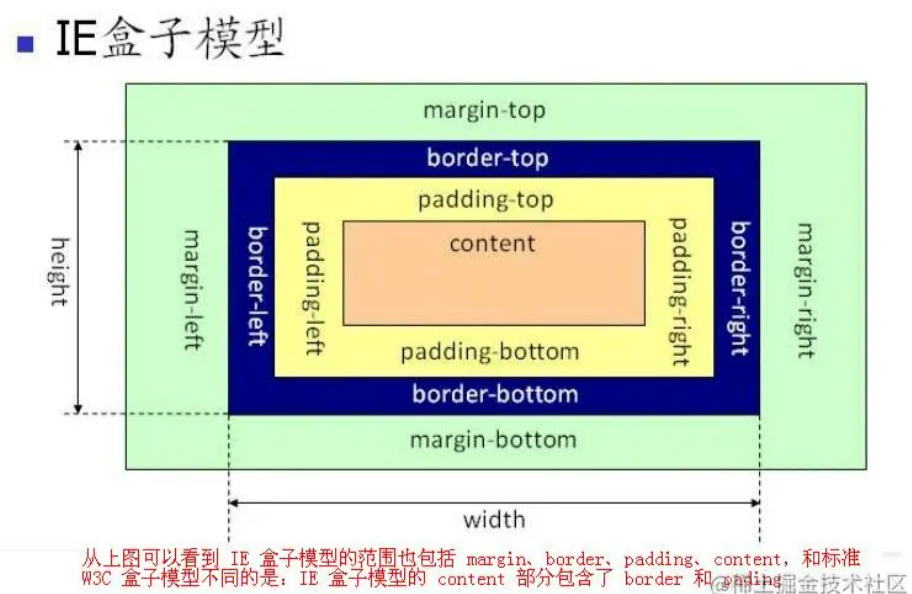
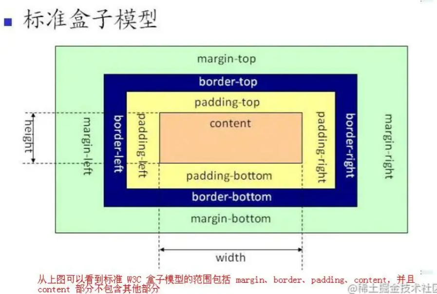

## 盒子模型

- 盒模型：分为内容（content）、内边距（padding）、外边距（margin）、边框（border）四个部分。
    1. IE盒模型（border-box 怪异盒模型）：content + padding + border 。
        - 宽高 = content + padding + border
        
    2. W3C标准盒模型（content-box 标准盒模型）：只包含内容 content。
        - 宽高 = content
        

    > 怪异盒模型的宽度 = 标准盒模型 border 和 padding + 标准盒模型内容的宽度

    ```css
        // W3C盒子模型
        box-sizing: content-box 
        // IE盒子模型
        box-sizing: border-box 
        // 继承父元素的盒模型
        box-sizing: inherit 
    ```
- 通过负边距进行偏移的元素，它会放弃偏移前占据的空间，这样它后面文档流中的其它元素就会“流”过来填充这部分空间。**文档流只能是后面的流向前面的，即文档流只能向左或向上流动，不能向下或向右移动**


## CSS选择器及其优先级

|选择器|格式|优先级权重|
|---|---|---|
|id选择器|#id|100|
|类选择器|.class|10|
|属性选择器|a[ref=“eee”]|10|
|伪类选择器|li:last-child|10|
|标签选择器|div|1|
|伪元素选择器|li:after|1|
|相邻兄弟选择器|h1+p 在h1后的所有p元素|0|
|子选择器|ul>li 父元素为ul的所有li的元素|0|
|后代选择器|li a 为li下的所有a元素|0|
|通配符选择器|*|0|
|群组选择器|（div,p）,选择 div、p 的所有元素| |

- 优先级：!important 无穷大 > 内联样式 > id 选择器 > 类选择器 > 标签选择器

## 属性的是否默认继承

- 默认继承 = 相当于设置了 `inherit`
- 默认不继承 = 相当于设置了 `initial`

- 默认不继承：
    所有元素：all、display、overflow、contain
    文本属性：vertical-align、text-decoration、text-overflow
    盒子属性：宽、高、内外边距、边框、min-..、max-...
    背景属性：背景图片、颜色、位置、background-repeat、background-attachment
    定位属性：float、clear、position、top、right、bottom、left、z-index
    内容属性：content、counter-reset、counter-increment
    轮廓属性：outline-style、outline-width、outline-color、outline
    页面属性：size、page-break-before、page-break-after
    声音属性：pause-before、pause-after、pause、cue-before、cue-after、cue、play-during

## px、em、rem、vh、vw、vm 的区别

- 相对长度单位：	em、ex、ch、rem、vw、vh、vmin、vmax、%
- 绝对长度单位：	cm、mm、in、px、pt、pc

1. px，像素可以理解为，我们设备上的画面是由一个一个的像素点组成的，每个像素点大小都是等同的（绝对长度）。但是在移动端有不同的设备像素比导致这个像素大小是不确定的，在不同的设备px可能展示的是不同的距离（相对长度）。

2. em，相对单位，继承父元素的字体大小，默认字体大小为16px=1em。

3. rem，相对单位，相对的是HTML根元素的字体大小，默认字体大小为16px=1em，两者区别 `rem`是相对根元素，一个是继承父元素。

4. vh、vw，相对元素，相对的窗口大小（浏览器的可视区域或者移动端的布局视口），将窗口大小分为100份。

5. % 百分比则是相对父元素的比宽，在不同的布局下定位不同，正常情况是相对父元素

6.vm，相对于视口的 宽度 或 高度 中较小的那个。最小的那个被均分为100单位的vm

## BFC

- **block formatting content快级格式上下文**

- 相当于一个容器，里面的布局不会影响到外面的元素

- 触发BFC

    1. overflow: hidden | scroll | auto  不是visible就行
    2. display: inline-block | table-cell | flex | table-caption | grid  不是block，nono,inline就行
    3. position: absolute | fixed   不是relative就行
    4. float: left | right
    5. body: BFC元素

- 规则

    1. BFC就是一个块级元素，块级元素会在垂直方向一个接一个的排列
    2. BFC就是页面中的一个隔离的独立容器，**容器里的标签不会影响到外部标签**
    3. 垂直方向的距离由margin决定， 属于同一个BFC的**两个相邻的标签外边距会发生重叠**
    4. 计算BFC的高度时，**浮动元素也参与计算**

- 父元素塌陷，清楚浮动，margin重叠，两栏布局。

## 动画有哪些？

    - animation：用于设置动画属性，他是一个简写的属性，包含6个属性
    - transition：用于设置元素的样式过度，和animation有着类似的效果，但细节上有很大的不同
    - transform：用于元素进行旋转、缩放、移动或倾斜，和设置样式的动画并没有什么关系
    - translate：translate只是transform的一个属性值，即移动，除此之外还有 scale 等

- transition和animation的区别
    - **transition是过度属性**，强调过度，它的实现需要触发一个事件（比如鼠标移动上去，焦点，点击等）才执行动画。它类似于flash的补间动画，设置一个开始关键帧，一个结束关键帧。

    - **animation是动画属性**，它的实现不需要触发事件，设定好时间之后可以自己执行，且可以循环一个动画。它也类似于flash的补间动画，但是它可以设置多个关键帧（用@keyframe定义）完成动画


## 水平、垂直居中

- 行内元素`text-align: center`;
- 对于确定宽度的块级元素：
    1. **width和margin实现**。margin: 0 auto;
    2. **绝对定位和margin-left**: (父width - 子width）/2, 前提是父元素position: relative
- flex
    ```js
    display: flex
    /* 垂直居中 */
    align-items: center;
    /* 水平居中 */
    justify-content: center;
    ```

## visibility 和 display 的差别（还有opacity)

- visibility 设置 hidden 会隐藏元素，但是其位置还存在与页面文档流中，不会被删除，所以会触发浏览器渲染引擎的**重绘**
- display 设置了 none 属性会隐藏元素，且其位置也**不会被保留下来**，所以会触发浏览器渲染引擎的**回流和重绘**。
- opacity 会将元素设置为透明，但是其位置也在页面文档流中，不会被删除，所以会触发浏览器渲染引擎的**重绘**


