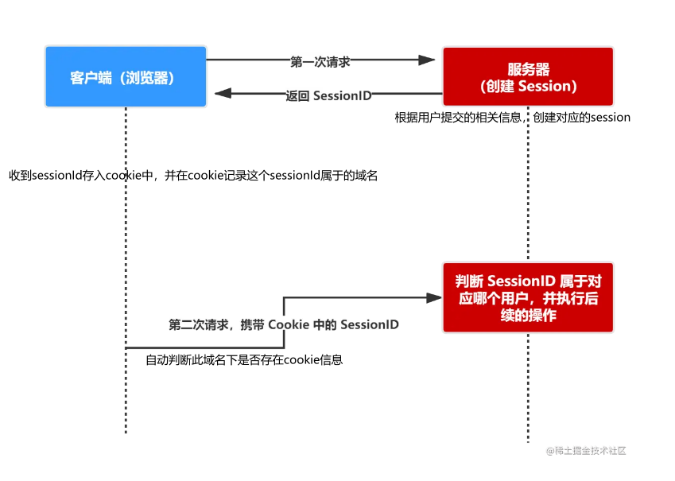

## Cookie、Session、Token、JWT

- 实现授权的方式有：cookie、session、token、OAuth

### cookie

- HTTP 是无状态的协议，无法辨别上一次访问者与次此是不是同一个人。所以服务器与浏览器为了进行会话跟踪（知道是谁在访问我），就必须主动的去维护一个状态，这个状态用于告知服务端前后两个请求是否来自同一浏览器。而这个状态需要通过 cookie 或者 session 去实现。

- **cookie 存储在客户端**： cookie 是服务器发送到用户浏览器并保存在本地的一小块数据，它会在浏览器下次向同一服务器再发起请求时被携带并发送到服务器上。

- **cookie 是不可跨域的**： 每个 cookie 都会绑定单一的域名，无法在别的域名下获取使用，一级域名和二级域名之间是允许共享使用的（靠的是 domain）。

- k : v、domain、path、maxAge、expires、secure、httpOnly

### session

- session 是另一种记录服务器和客户端会话状态的机制

- session 是基于 cookie 实现的，**session 存储在服务器端**，sessionId 会被存储到客户端的cookie 中

### Cookie 和 Session 的区别

- Session 比 Cookie **安全**，Session 是存储在服务器端的，Cookie 是存储在客户端的。
- Session 可以存任意数据类型， Cookie 只支持存字符串数据，(其他类型得转换成字符串)，
- Session 一般失效时间较短，或者 Session 超时都会失效，Cookie 可设置为长时间保持
-  Session 可存储数据远高于 Cookie，访问量过多，会占用过多的服务器资源，单个 Cookie 保存的数据**不能超过 4K**

### Token

- Acesss Token
    - 访问资源接口（API）时所需要的资源凭证
    - 简单 token 的组成： uid、time、sign（签名，token 的前几位以哈希算法压缩成的一定长度的十六进制字符串）

    - **每一次请求都需要携带 token，需要把 token 放到 HTTP 的 Header 里**
    - **基于 token 的用户认证是一种服务端无状态的认证方式，服务端不用存放 token 数据。用解析 token 的计算时间换取 session 的存储空间，从而减轻服务器的压力，减少频繁的查询数据库**
    - **token 完全由应用管理，所以它可以避开同源策略**

- Refresh Token
    - 专用于刷新 access token 的 token。

### Token 和 Session 的区别

- Session 是一种记录服务器和客户端会话状态的机制，**使服务端有状态化，可以记录会话信息**。而 Token 是令牌，访问资源接口（API）时所需要的资源凭证。**Token 使服务端无状态化，不会存储会话信息**。

- 作为身份认证 Token 安全性比 Session 好，因为每一个请求都有签名还能防止监听以及重放攻击，而 Session 就必须依赖链路层来保障通讯安全了。

### JWT

- JSON Web Token（简称 JWT）是目前最流行的跨域认证解决方案。**认证授权机制**
