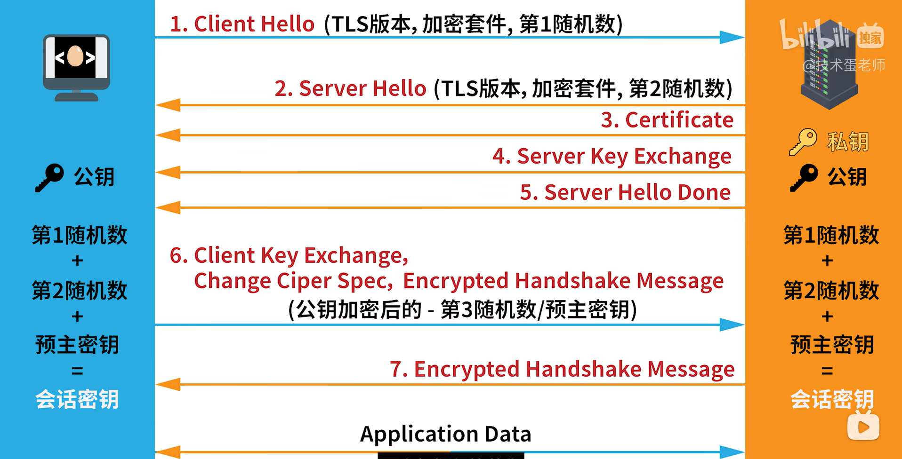

# HTTP和HTTPS的区别

- HTTPS在HTTP的基础上加入了**SSL协议**，SSL依靠证书来验证服务器的身份，并为浏览器和服务器之间的通信加密。

- HTTPS协议的主要作用可以分为两种：
    - 一种是建立一个信息安全通道，来保证数据传输的安全；
    - 另一种就是确认网站的真实性。

1. https协议需要到ca申请证书，一般免费证书较少，因而需要一定费用。
2. http是超文本传输协议，信息是**明文传输**，https则是具有安全性的ssl**加密传输协议**。
3. http和https使用的是完全不同的连接方式，用的端口也不一样，**http是80，https是443**。
4. http的连接很简单，是**无状态**的；HTTPS协议是由SSL+HTTP协议构建的可进行**加密传输、身份认证**的网络协议，比http协议安全。

## https工作原理

1. **客户端发起HTTPS请求**，输入https网址，连接到server的443端口
2. **服务端的配置**，采用HTTPS协议的服务器必须要有一套数字证书，一对公钥和私钥，**相当于锁头和钥匙，锁头可以很多，钥匙只有一把**
3. **传送证书**，公钥，只是包含了很多信息，如证书的颁发机构，过期时间等等。
4. **客户端解析证书**，客户端的TLS，首先会验证公钥是否有效，有问题提示证书有问题；没有问题，那么就生成一个随机值，然后用证书对该随机值进行加密。
5. **传送加密信息**，让服务端得到这个随机值
6. **服务段解密信息**，用私钥解密后，得到了客户端传过来的随机值(私钥)，然后把内容通过该值进行对称加密，（将信息和私钥通过某种算法混合在一起）
7. **传输加密后的信息**，服务段用私钥加密后的信息，可以在客户端被还原。
8. **客户端解密信息**，用之前生成的私钥解密服务段传过来的信息